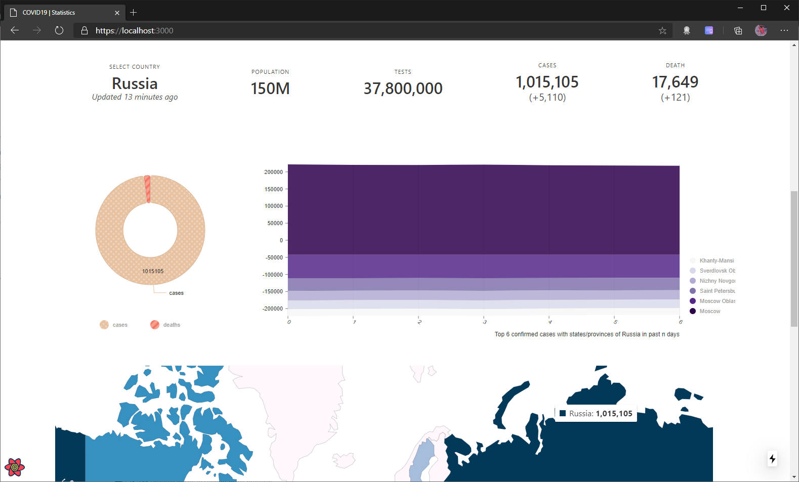
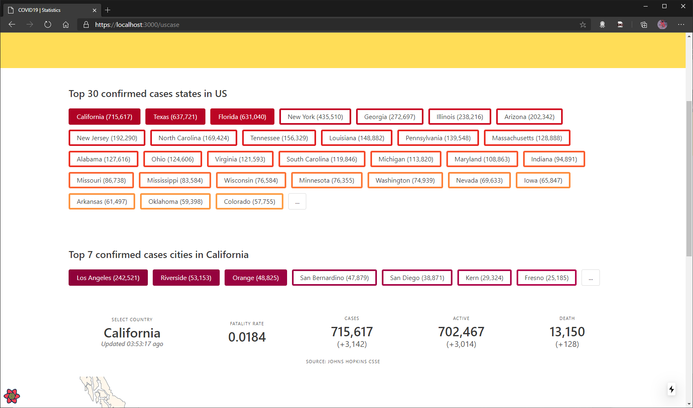
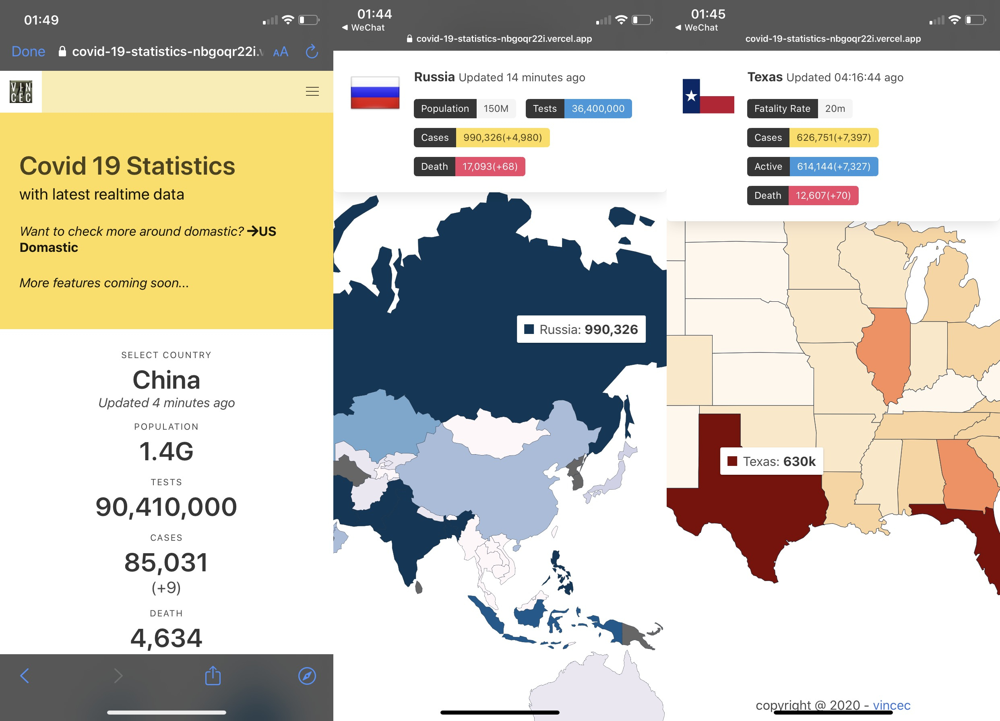

# COVID19-statistics

[covid-19-statistics](//covid-19-statistics.vercel.app/)

#### Desktop




#### Mobile



## Stack:

- [next.js](//nextjs.org/)
- Typescript
- [react-query](//react-query.tanstack.com/)
- [framer-motion](//www.framer.com/motion/)
- [bulma](//bulma.io/)
- [nivo](//nivo.rocks/)
- [rapidapi](//rapidapi.com/)
- [vercel](//vercel.com)

## Deploy

```js
/* Config env, add .env file with following three environment
 - API_KEY
 - COVID_API_HOST: covid-19-data.p.rapidapi.com
 - COVID_API_HOST2: covid-193.p.rapidapi.com
 - COVID_API_HOST3: covid-19-statistics.p.rapidapi.com
*/

yarn install

// Replace your certificates key and cert under /certificates folder for local https testing, recommand using mkcert

yarn dev
```

## Features

- Always syncing with latest covid19 statistic with countries and its provinces
- Global and US domestic wide
